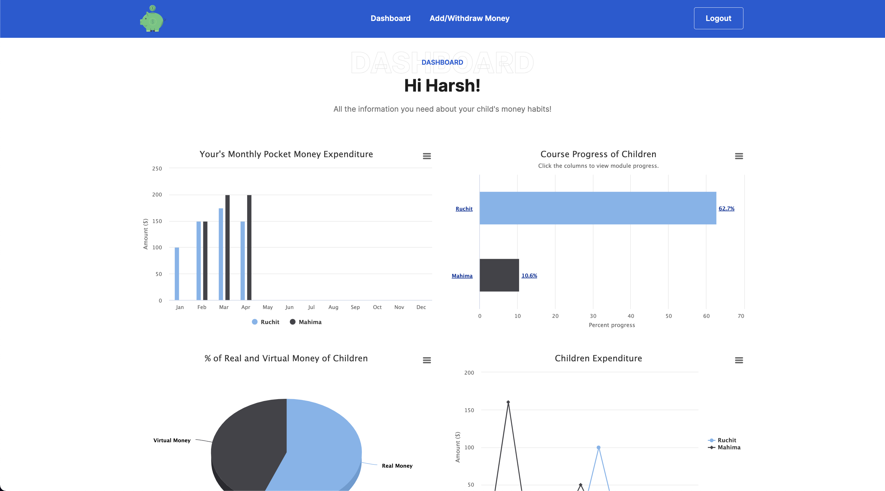
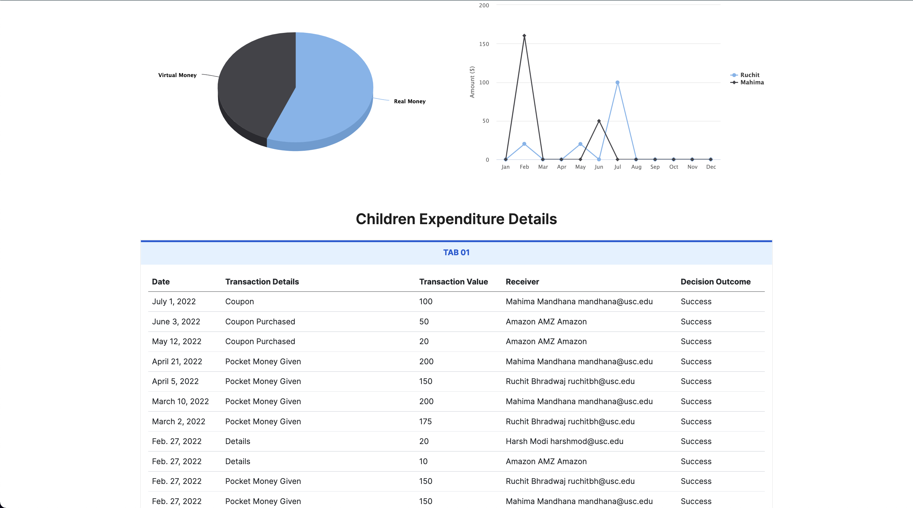
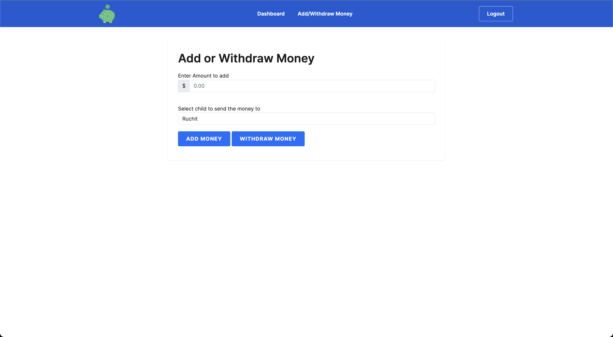
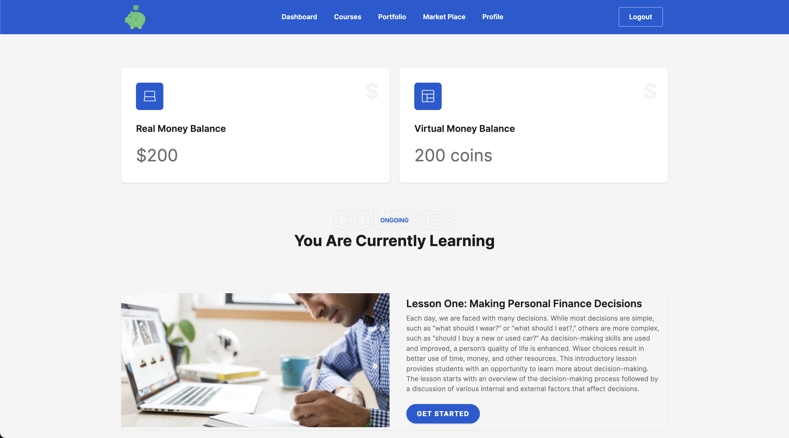
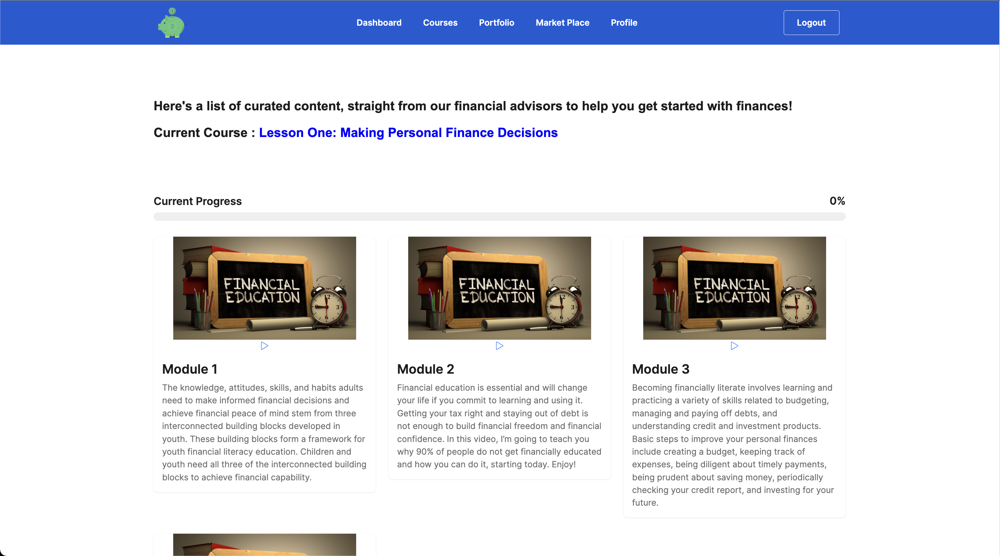
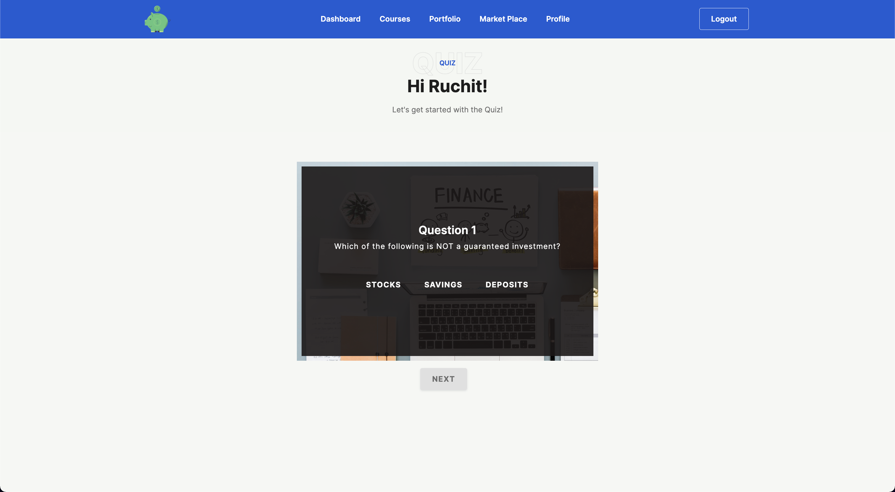
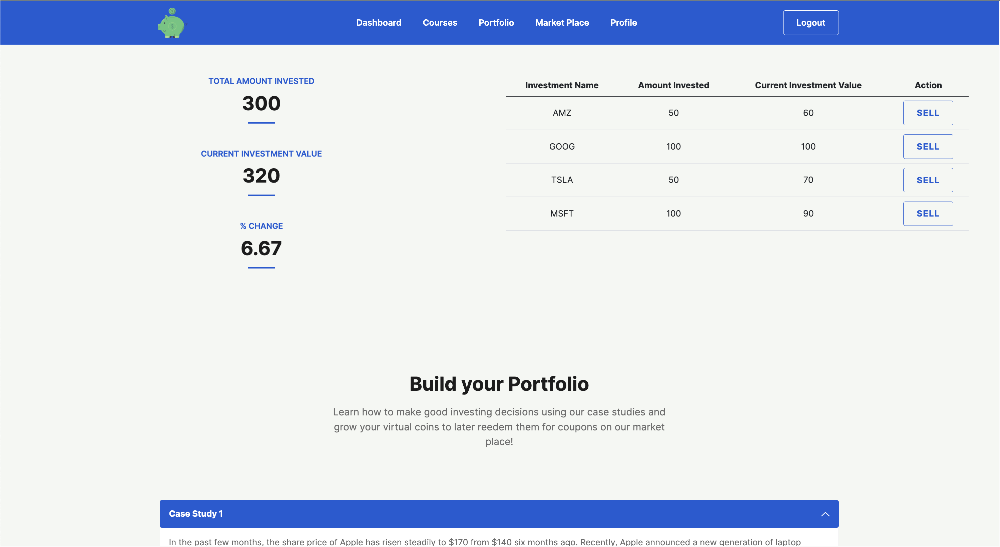
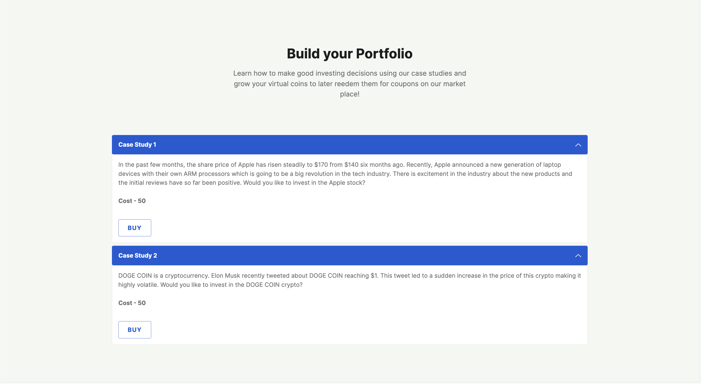
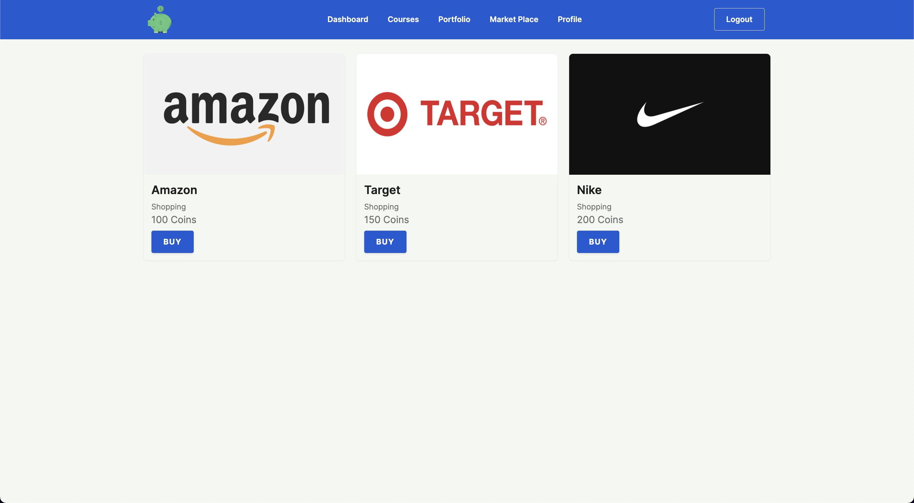
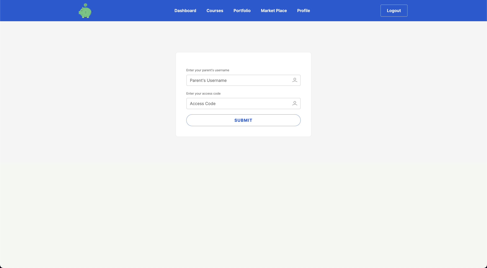

# Pocket Invest

### A platform that helps young adults better learn and manage their finances from an early age

---

## Pocket-Invest: Demo

---

## Pocket-Invest: Devpost

---

## Inspiration

During a recent survey regarding the financial education, there were the following findings -

- 1 in 5 teens lack a basic foundation to build on for financial literacy.
- 74% of teens don’t feel confident about their financial education.
- 46% of teens don’t know what a 401(k) is

These statistics make it obvious that children in their teens are not exposed to the correct education content that would point them in the right direction, and set them up for financial freedom starting early in their lives. The 'financial-educators' currently in-place are either, not easily accessible, or are too legacy and have not been adapted to the latest trends in the market.

None of the financial education solutions out there are built to cater to the teen population in mind, but rather focus on the traditional strata of males between 25-45 years of age and this is the gap that we are trying to fill.

Enter, Pocket-Invest, a state of the art, financial educator platform, that tries to simplify hard money-related concepts, into easy-to-consume, byte-sized chunks, perfect for consumption by young adults.

We believe, that financial literacy is not an end in itself, but a step-by-step process. It begins in childhood and continues throughout a person’s life all the way to retirement. Instilling the financial-literacy message in children is especially important, because they will carry it for the rest of their lives!

## Pocket-Invest: The Idea

- **Pocket Money**: parents can give pocket money to their kids using our platform.
- **Virtual Tokens**: Simultaneously, when parents add pocket money to the platform, their children also receive equivalent virtual tokens. In case of a girl child, these virtual tokens will be 1.5x the amount of pocket money loaded to the platform. So, for eg. if a parent adds $20 to the platform in terms of pocket money, his child will receive 20 equivalent virtual tokens. In case of a girl child, they will receive 1.5x the value, i.e. 30 virtual tokens. This is done to include and promote the partition of girl child in the stock market.
- **Dummy Stock Market Entity**: A virtual platform that has been carefully curated, based on actual historical occurrences in the stock market. This provides a playground for children to get their hands dirty by investing in this dummy stock market, but this time, historical results can be used to actually judge a child's decision!
- **Financial planning courses and modules**: Any child can view from our vast repository of courses to increase financial acumen.

## Pocket-Invest: Salient Features

- Enhancing inclusivity of girl children in stock market by providing them 1.5x the virtual tokens
- Provides an entire dummy stock market as a playground to get a real world experience of investing with one added benefit - the results are known this time!
- Feedback based mechanism to sharpen investment skills.

## Pocket-Invest: Actions & Reward Mechanism

- Virtual tokens can be used to invest in our dummy stock market
- Completing courses allows a child to unblock a portion of their pocket money.
- This unblocked money can be used to buy coupons from affiliated vendors from our marketplace.

## Pocket-Invest: The Tech Stack

| Area     | Technologies used                                |
| -------- | ------------------------------------------------ |
| Frontend | HTML5, CSS3, Javascript, Bootstrap, jQuery, AJAX |
| Backend  | Django Framework                                 |
| Database | SQLite                                           |

## Pocket-Invest: What's Next!

- Building a library of simplified courses that could be hosted on our platform.
- Introducing charities to our marketplace
- This concept can easily be expanded to target other such complex ideas and make them easy to deliver for young adults!

## Pocket-Invest: Gallery

|  |
| :-----------------------------------------------------: |
|                    Parent Dashboard                     |

|  |
| :---------------------------------------------------------: |
|                      Parent Dashboard                       |

|  |
| :-------------------------------------------------------------------------------: |
|                           Parent Dashboard Transactions                           |

|  |
| :---------------------------------------------------: |
|                    Child Dashboard                    |

|  |
| :-----------------------------------------------: |
|                   Child Courses                   |

|  |
| :---------------------------------------------------------------: |
|                     Child Courses => Modules                      |

|  |
| :-------------------------------------------------------------------------: |
|                      Child Courses => Modules => Quiz                       |

|  |
| :---------------------------------------------------: |
|                    Child Portfolio                    |

|  |
| :-------------------------------------------------------: |
|                     Child Portfolio 2                     |

|  |
| :-------------------------------------------------------: |
|                     Child Marketplace                     |

|  |
| :-------------------------------------------------------------: |
|                      Child Parent Linking                       |
